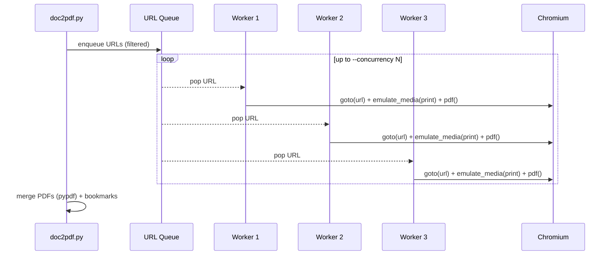

# doc2pdf

Turn an entire documentation site into **one PDF** for downstream LLM/agent ingestion.  
It (1) collects URLs (sitemap or crawl), (2) renders each page to PDF with **Playwright/Chromium** (print CSS), and (3) **merges** them with per-URL **bookmarks**.

---

## ✨ Features
- **Two input modes**: `--sitemap` _or_ `--start` (same‑domain BFS crawl)
- **Filters**: `--include`, `--exclude` to precisely scope what gets captured
- **Fidelity**: Chromium **print CSS** & background graphics
- **Bookmarks**: One bookmark per page (the source URL)
- **Respectful**: Honors `robots.txt`, adds polite delays, tunable concurrency
- **Portable**: Single, merged PDF suitable for RAG/embedding pipelines

---

## 📁 Project structure

```
.
├── LICENSE
├── README.md
├── doc2pdf.py
├── Makefile
├── pyproject.toml
└── requirements.txt
```

## 🧭 How it works

### 1) Pipeline overview
```mermaid
flowchart LR
    A[Start URL or sitemap.xml] --> B{Collect URLs}
    B -->|BFS same-domain or sitemap| C[URL list]
    C --> D[Render each URL with Playwright/Chromium<br/>emulate_media(print), print_background]
    D --> E[Per-page PDFs]
    E --> F[Merge with pypdf<br/>+ add a bookmark per URL]
    F --> G[Single merged PDF]
```

### 2) Concurrency model (workers)


---

## 🚀 Install
```bash
python -m venv .venv && source .venv/bin/activate   # Windows: .venv\Scripts\activate
pip install -r requirements.txt
playwright install chromium
```

> **If Chromium fails to launch** (missing system deps), run:
> ```bash
> python -m playwright install-deps chromium
> python -m playwright install chromium
> ```
> or on Debian/Ubuntu:
> ```bash
> sudo apt-get update && sudo apt-get install -y \
>   libnss3 libxss1 libasound2 libatk1.0-0 libatk-bridge2.0-0 libcups2 \
>   libdrm2 libxkbcommon0 libxcomposite1 libxdamage1 libxfixes3 libxrandr2 \
>   libgbm1 libatspi2.0-0
> ```

---

## 🧪 Quick start
**Using a sitemap (best if available)**
```bash
python doc2pdf.py \
  --sitemap https://your-docs-site.com/sitemap.xml \
  --include "/docs/" \
  --exclude "/blog/" \
  --out your-docs.pdf
```

**Crawling from a start URL (same-domain)**
```bash
python doc2pdf.py \
  --start https://your-docs-site.com/docs/ \
  --max-pages 300 \
  --include "/docs/" \
  --exclude "/blog/,?utm_" \
  --out your-docs.pdf
```

---

## 📚 Real example – Google ADK docs (no Java API)
Create a single PDF from <https://google.github.io/adk-docs/> while excluding Java API pages and query-string duplicates:
```bash
python doc2pdf.py \
  --start https://google.github.io/adk-docs/ \
  --max-pages 500 \
  --exclude "/api-reference/java/,?" \
  --concurrency 3 \
  --timeout 90 \
  --out adk-no-java.pdf
```

### Variants
- **Guides only**
  ```bash
  python doc2pdf.py \
    --start https://google.github.io/adk-docs/ \
    --max-pages 400 \
    --include "/get-started/,/agents/,/tools/,/tutorials/,/streaming/" \
    --exclude "/api-reference/,?" \
    --out adk-guides.pdf
  ```

- **Python API reference only**
  ```bash
  python doc2pdf.py \
    --start https://google.github.io/adk-docs/api-reference/python/ \
    --max-pages 400 \
    --include "/api-reference/python/" \
    --exclude "?,/api-reference/java/" \
    --out adk-python-api.pdf
  ```

---

## ⚙️ CLI Reference
```text
--sitemap URL          Sitemap.xml to enumerate pages (recommended when present)
--start URL            Start URL to crawl (same-domain BFS)
--include CSV          Comma-separated substrings URLs must include
--exclude CSV          Comma-separated substrings URLs must exclude
--out PATH             Output merged PDF
--max-pages INT        Cap the number of pages in crawl mode (default 500)
--concurrency INT      Parallel page renders (default 4)
--timeout INT          Per-page load timeout in seconds (default 45)
--keep                 Keep individual PDFs under ./_build
```

**Tips**
- Keep scope tight with `--include` (e.g., `/docs/`, `/v1/`) to avoid nav/search pages.
- Use `--exclude "?,#"` to skip query-string/anchor dupes.
- Try `--concurrency 2-3` on slow sites; increase `--timeout` for JS-heavy pages.
- Add a short settle wait if needed (inside the script after `page.goto(...)`):
  ```python
  await page.wait_for_timeout(1500)  # 1.5s for dynamic content to finish
  ```

---

## 🤖 Feeding the PDF to an LLM (RAG-friendly)
- **Chunking**: Split into 2–6k‑token chunks (page or section boundaries). Store in FAISS/Milvus/pgvector.
- **Citations**: Use the embedded **bookmarks** (source URLs) to map answers back to pages.
- **Prefer HTML for raw text**: If you don’t need visual fidelity, scraping + clean‑text is often smaller/noisier‑free for embeddings.

Example (very rough) to split per page:
```python
from pypdf import PdfReader
reader = PdfReader("adk-no-java.pdf")
pages = [page.extract_text() or "" for page in reader.pages]
# Now chunk pages and embed them with your favorite vector DB
```

---

## 🧰 Docker (no system deps on host)
```bash
docker run --rm -it \
  -v "$PWD":/work -w /work \
  mcr.microsoft.com/playwright/python:v1.48.0-jammy \
  bash -lc 'pip install -r requirements.txt && python doc2pdf.py \
    --start https://google.github.io/adk-docs/ \
    --max-pages 500 --exclude "/api-reference/java/,?" \
    --concurrency 3 --timeout 90 --out adk-no-java.pdf'
```

---

## 🔎 Troubleshooting
- **Chromium won’t start** → Install deps (see Install section) or use the Docker image.
- **Blank pages** → Increase `--timeout`; insert a `wait_for_timeout` after `goto`.
- **Missing pages** → Tighten `--include`; ensure they are same-domain; check `robots.txt`.
- **Rate limiting** → Lower `--concurrency`, add pauses, or split into batches.
- **Gigantic PDFs** → Use targeted subsets or compress post-merge.

## 🧰 Makefile quick start
```bash
make venv && source .venv/bin/activate
make install            # installs package (-e .) + Playwright Chromium
make adk-full           # builds adk-no-java.pdf
# Other presets:
make adk-guides
make adk-python-api
```

## 🔗 CLI usage (installed)
```bash
pip install -e .
python -m playwright install chromium
doc2pdf --start https://google.github.io/adk-docs/ --exclude "/api-reference/java/,?" --out adk-no-java.pdf
```

## ⚠️ Known limitations
- **SPA/dynamic content**: If sections load lazily, raise `--timeout` or add a small `wait_for_timeout` after `goto`.
- **Auth/cookie walls**: Not supported out of the box.
- **Cross-domain links**: The crawler stays same-domain by design.
- **Duplicate pages**: Use `--exclude "?,#"` to skip querystring/anchor duplicates.
- **Very large docs**: Lower `--concurrency`, split runs, or render targeted subsets.

## 🛠️ Performance tuning
- Slow sites → `--concurrency 2–3`, `--timeout 90`.
- JS-heavy pages → add `await page.wait_for_timeout(1500)` before `page.pdf()`.
- Huge output → subset with `--include` or compress post-merge.

---

## 📜 Ethics & Terms
- Respect each site’s **robots.txt** and **Terms of Service**.
- For internal/enterprise docs, ensure you have permission to crawl and capture.

---

## License
MIT © 2025 Konstantinos Soufleros — see [LICENSE](./LICENSE).

## Author
Konstantinos Soufleros - AI/ML Engineer 2025